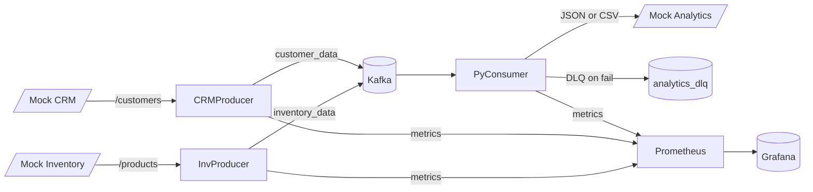

# Architecture

This integration pipeline consists of the following components:

- Java/Spring Boot producers (`java-producers/`)
  - `crm-producer`: polls Mock CRM `GET /customers`
  - `inventory-producer`: polls Mock Inventory `GET /products`
  - Publishes to Kafka topics `customer_data`, `inventory_data`
  - Retries/backoff and DLQ topics on publish failures
- Kafka + Zookeeper + Kafka UI (`infrastructure/docker-compose.yml`)
- Python async consumer (`python-consumers/analytics_consumer/`)
  - Consumes `customer_data` & `inventory_data`
  - In-memory merge
  - Idempotency via Redis (digest per topic/key)
  - Delivers to Analytics via REST JSON or CSV batching
  - DLQ on downstream POST failures (`analytics_dlq`)
  - Exposes Prometheus metrics
- Mock APIs (`mock-apis/fastapi_app/`)
  - `GET /customers`, `POST /customers`
  - `GET /products`
  - SOAP stub: `POST /soap/AddCustomer`
  - Analytics ingestion: `POST /analytics/data` (JSON) and `POST /analytics/upload` (CSV)
  - Exposes Prometheus `/metrics`
- Prometheus + Grafana (`infrastructure/`)
  - Prometheus scrapes producers, consumer, and mock APIs
  - Grafana provisioned with a “Kafka Integration Overview” dashboard

